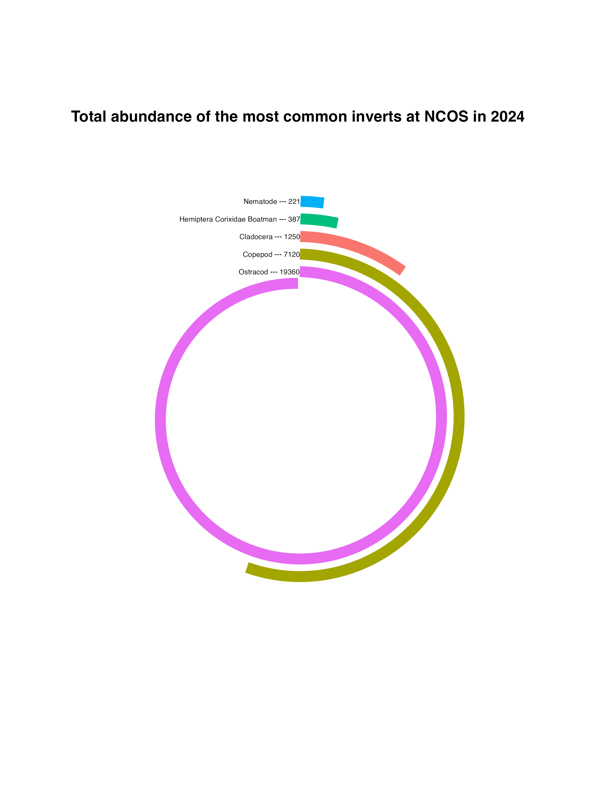

# General information

This repository is for the intermediate elective option 2 focusing on aquatic inverts 

Made by Stella Freedberg 

Inspired by Ijeamaka Anyenes 2021_06_dubois graphic 
[code template](https://github.com/Ijeamakaanyene/tidytuesday/blob/master/scripts/2021_06_dubois_data.Rmd)
 and [visual inspiration](https://github.com/Ijeamakaanyene/tidytuesday)

# Data and file information

Files include readme, code, and data. Data files use data sets collected by the North Campus Open Space at UCSB. Code files include template code and code for the elective output.

# Rendered output 

Link to rendered assignment pdf [here](https://github.com/Stella-freedberg/intermediate-elective/blob/main/code/Intermediate-elective.pdf)

